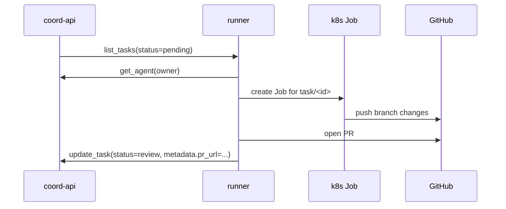

# mcp-coord

Reusable coordination infrastructure for multi-agent projects.

Today this repo ships:

- `packages/api`: NestJS MCP server (`/mcp`, `/sse`)
- `packages/web`: Next.js dashboard for agents, tasks, messages, and plans
- `packages/runner`: optional runner that turns assigned tasks into isolated Kubernetes Jobs and pull requests
- `charts/coord`: Helm chart used to deploy the API or web app, with optional runner support on a release

> This README is written for consumers installing a published chart/image release into a new project, not for local-only development.

## What mcp-coord is

`mcp-coord` gives your agents and operators a shared coordination plane:

- agents call MCP tools over JSON-RPC 2.0 at `POST /mcp`
- the API authenticates every request with `X-Coord-Key`
- writes emit PostgreSQL `NOTIFY` events
- the dashboard listens on `GET /sse?stream=dashboard` for live invalidations
- the optional runner polls pending tasks, resolves the assigned agent's configured driver, spawns a per-task Job, and pushes a review PR
- PostgreSQL stores agents, tasks, messages, and plans in a generic coordination schema

One Helm chart deploys both components. Install it once for `component=api` and again for `component=web`. If you want automated task execution, enable the runner on the API release with `runner.enabled=true`.

## Prerequisites

| Requirement | Notes |
|---|---|
| k3s cluster | Any recent k3s install is fine; examples assume an ingress controller is available. |
| PostgreSQL 16+ | Required by `packages/api`; supply a reachable `DATABASE_URL`. |
| Helm 3.12+ | Matches the chart and release workflow assumptions. |
| DNS/TLS | Recommended for published use because MCP clients and the dashboard usually connect over HTTPS. |

### Publisher prerequisites

If you are publishing your own releases from this repo:

- release tags publish `ghcr.io/<OWNER>/mcp-coord-api:<tag>`, `ghcr.io/<OWNER>/mcp-coord-web:<tag>`, `ghcr.io/<OWNER>/mcp-coord-runner:<tag>`, and the Helm chart at `oci://ghcr.io/<OWNER>/charts/coord`
- the release workflow uses the built-in `GITHUB_TOKEN` for both image pushes and `helm push`
- default images and chart publishing assume the `psws-pl/mcp-coord` repository; override those only if you publish under a different owner

## Quick start

Authenticate to GHCR first if the package is private or you want authenticated pulls:

```bash
export GHCR_USERNAME=<OWNER>
export GHCR_TOKEN=<TOKEN>
printf '%s' "$GHCR_TOKEN" | helm registry login ghcr.io \
  --username "$GHCR_USERNAME" \
  --password-stdin
```

### 1) Deploy the API

Minimum API values:

```yaml
# coord-api-values.yaml
component: api

image:
  repository: ghcr.io/<OWNER>/mcp-coord-api
  tag: v0.2.0

ingress:
  enabled: true
  className: traefik
  hosts:
    - host: coord-api.example.com
      paths:
        - path: /
          pathType: Prefix

secret:
  create: true
  databaseUrl: postgres://coord:<password>@postgresql.default.svc.cluster.local:5432/coord
  coordApiKeys: orch=<token>,dashboard=<token>,backend=<token>

migration:
  enabled: true

# optional: enable the runner on the same release
runner:
  enabled: true
  config:
    mcoordUrl: https://coord-api.example.com/mcp
    githubRepo: <OWNER>/<REPO>
    defaultDriver: claude
  secretRefs:
    secretName: coord-runner-secrets
```

Install:

```bash
helm upgrade --install coord-api oci://ghcr.io/<OWNER>/charts/coord \
  --version 0.2.0 \
  -n coord --create-namespace \
  -f coord-api-values.yaml
```

### 2) Deploy the dashboard

Minimum web values:

```yaml
# coord-web-values.yaml
component: web

image:
  repository: ghcr.io/<OWNER>/mcp-coord-web
  tag: v0.2.0

ingress:
  enabled: true
  className: traefik
  hosts:
    - host: coord.example.com
      paths:
        - path: /
          pathType: Prefix

env:
  values:
    COORD_API_URL: https://coord-api.example.com
    NEXT_PUBLIC_API_URL: https://coord-api.example.com
  secretRefs:
    - name: COORD_API_KEY
      key: COORD_API_KEY

secret:
  create: true
  extra:
    COORD_API_KEY: <dashboard-token>
```

Install:

```bash
helm upgrade --install coord-web oci://ghcr.io/<OWNER>/charts/coord \
  --version 0.2.0 \
  -n coord \
  -f coord-web-values.yaml
```

### 3) Point MCP clients at the API

Use `https://coord-api.example.com/mcp` with an `X-Coord-Key` header.

Example:

```json
{
  "servers": {
    "coord": {
      "type": "http",
      "url": "https://coord-api.example.com/mcp",
      "headers": {
        "X-Coord-Key": "${COORD_API_KEY}"
      }
    }
  }
}
```

## Optional runner

Enable the runner by setting `runner.enabled=true` on your API chart release. The chart then adds:

- a `Deployment` running `packages/runner`
- a `PersistentVolumeClaim` named `agent-workdir`
- a ServiceAccount / Role / RoleBinding so the runner can create, watch, and delete Jobs in its namespace

The runner does this loop:

1. polls pending coordination tasks
2. fetches the assigned agent record with `get_agent(owner)`
3. uses `coord_agents.driver` when it is set, otherwise falls back to `DEFAULT_DRIVER`
4. creates branch `task/<task-id>`
5. spawns one Kubernetes Job for that task
6. pushes the task branch and opens a pull request
7. updates the task to `review` with PR metadata



### Runner secrets

Two secret paths are involved today:

- the runner `Deployment` requires a secret referenced by `runner.secretRefs.secretName`
- spawned driver Jobs read provider credentials from the namespace secret expected by the driver implementation

Minimum required keys for the runner `Deployment` secret:

- `MCOORD_KEY`: sent to `MCOORD_URL` as `X-Coord-Key`
- `GITHUB_TOKEN`: used for cloning, pushing task branches, and opening PRs

Per-driver credentials are separate. The current built-in Claude driver expects:

- `ANTHROPIC_API_KEY` in the namespace secret `<namespace>-secret` (for the default `coord` namespace, `coord-secret`)

If you add more drivers later, their Jobs need the matching provider keys too. Keep `DEFAULT_DRIVER=claude` unless your runner image has that other driver wired in.

### Driver selection and fallback

Driver selection is dynamic per assigned agent:

- runner reads the task owner, then calls `get_agent(owner)`
- if `coord_agents.enabled=false`, the task is skipped and no Job is created
- if `coord_agents.driver` is set, runner uses that driver
- if `coord_agents.driver` is `null`, runner uses `DEFAULT_DRIVER`

The chart value `runner.config.defaultDriver` writes `DEFAULT_DRIVER` into the runner container. In the current repo state, only the Claude driver is registered in the shipped runner startup wiring, even though the coordination schema reserves names for `codex`, `gemini`, `aider`, and `generic`.

### Shared workdir / PVC expectations

When enabled, the chart creates a PVC named `agent-workdir` and mounts it at `/workspace/project`.

- the runner `Deployment` init container keeps that checkout aligned with `GITHUB_REPO`
- spawned Jobs mount the same PVC and branch off the shared clone
- default storage settings are `ReadWriteOnce` and `10Gi`
- the current templates assume the runner and its Jobs run in the same namespace and use the fixed claim name `agent-workdir`

### Runner test coverage

The current runner integration coverage is mocked orchestration coverage only. It verifies runner lifecycle behavior in-process; it does **not** execute a real provider CLI, a real Kubernetes cluster, or real GitHub PR operations.

Run it from the repo root with:

```bash
pnpm --filter @mcp-coord/runner test
```

## Authentication and key format

`COORD_API_KEYS` is a comma-separated list.

- named key: `backend=secret-value`
- unnamed key: `secret-value`

Use named keys for normal deployments. They are required for:

- `get_messages`
- `ack_message`
- `send_message` calls that omit `from` (the dashboard does this)

## MCP tool signatures

All tools are exposed through `tools/list` and `tools/call` on `POST /mcp`.

| Tool | Signature | Notes |
|---|---|---|
| `register_agent` | `register_agent(name, status?, driver?, capabilities?, metadata?)` | `driver`: `claude|codex|gemini|aider|generic|null` |
| `update_agent_status` | `update_agent_status(name, status, current_task_id?, last_heartbeat_at?)` | heartbeat defaults to now when omitted |
| `configure_agent` | `configure_agent(name, enabled?, driver?, capabilities?, metadata?)` | at least one mutable field is required |
| `get_agent` | `get_agent(name)` | returns the agent plus related context |
| `list_agents` | `list_agents(enabled?)` | optional enabled filter |
| `create_task` | `create_task(title, id?, description?, status?, priority?, owner?, plan_id?, metadata?)` | defaults: `status=pending`, `priority=P2`, `owner=orch` |
| `update_task` | `update_task(id, status?, priority?, owner?, description?, plan_id?, metadata?)` | at least one mutable field is required |
| `assign_task` | `assign_task(id, owner)` | shorthand reassignment tool |
| `list_tasks` | `list_tasks(status?, owner?, plan_id?)` | optional filters |
| `get_task` | `get_task(id)` | fetch one task |
| `send_message` | `send_message(to, body, from?, type?, task_id?, plan_id?)` | default `type=question`; `from` may come from a named API key |
| `get_messages` | `get_messages(status?)` | only works with a named API key bound to the recipient |
| `ack_message` | `ack_message(id)` | only the addressed recipient can acknowledge a pending message |
| `create_plan` | `create_plan(name, id?, description?, status?, owner?)` | defaults: `status=draft`, `owner=orch` |
| `update_plan` | `update_plan(id \| planId, name?, description?, status?, owner?)` | at least one mutable field is required |
| `list_plans` | `list_plans(owner?, status?)` | optional filters |

### Allowed enum values

- agent status: `starting`, `running`, `waiting`, `completed`, `stale`, `terminated`
- task status: `pending`, `in_progress`, `review`, `done`, `blocked`, `cancelled`
- task priority: `P0`, `P1`, `P2`, `P3`
- message status: `pending`, `acknowledged`, `done`, `blocked`, `ignored`
- message type: `task`, `handoff`, `question`, `blocker`, `review-request`, `schema-change`, `env-change`, `broadcast`, `incident`
- plan status: `draft`, `active`, `paused`, `completed`, `cancelled`

## Values reference

| Path | Default | Purpose |
|---|---|---|
| `component` | `api` | Selects the deployed workload name/labels; use `api` or `web`. |
| `replicaCount` | `1` | Deployment replica count. |
| `image.repository` | `ghcr.io/psws-pl/mcp-coord-api` | Container image repository; override for published installs. |
| `image.tag` | `""` | Image tag; falls back to chart `appVersion` when empty. |
| `image.pullPolicy` | `IfNotPresent` | Standard Kubernetes pull policy. |
| `imagePullSecrets` | `[]` | Registry pull secrets. |
| `container.port` | `3000` | Exposed container port. |
| `container.command` / `container.args` | `[]` / `[]` | Optional command override. |
| `service.enabled` | `true` | Create a Service. |
| `service.type` | `ClusterIP` | Service type. |
| `service.port` | `80` | Service port. |
| `service.targetPort` | `3000` | Service target port. |
| `service.annotations` | `{}` | Extra Service annotations. |
| `ingress.enabled` | `false` | Create an Ingress. |
| `ingress.className` | `""` | Ingress class name. |
| `ingress.annotations` | `{}` | Extra Ingress annotations. |
| `ingress.hosts` | `coord.example.com` example | Host/path rules. |
| `ingress.tls` | `[]` | TLS entries. |
| `env.values` | `PORT=3000` | Plain environment variables. Use this for `COORD_API_URL` / `NEXT_PUBLIC_API_URL` on web. |
| `env.secretRefs` | `[]` | Extra env vars loaded from secrets. |
| `secret.create` | `false` | Create a Secret with `stringData`. |
| `secret.name` | `""` | Use an existing Secret name or override the generated one. |
| `secret.databaseUrl` | `""` | Written as `DATABASE_URL` when set. |
| `secret.coordApiKeys` | `""` | Written as `COORD_API_KEYS` when set. |
| `secret.extra` | `{}` | Extra secret keys; pair with `env.secretRefs` if the container must read them. |
| `probes.liveness.*` | disabled | HTTP liveness probe settings. |
| `probes.readiness.*` | disabled | HTTP readiness probe settings. |
| `migration.enabled` | `false` | Run the pre-install/pre-upgrade migration Job. |
| `migration.annotations` | `{}` | Extra hook annotations. |
| `migration.backoffLimit` | `3` | Migration Job retry limit. |
| `migration.ttlSecondsAfterFinished` | `300` | Migration Job cleanup TTL. |
| `migration.image.repository` | `""` | Override migration image repo; otherwise uses `image.repository`. |
| `migration.image.tag` | `""` | Override migration image tag; otherwise uses the workload tag. |
| `migration.command` / `migration.args` | TypeORM CLI run command | Migration command override. |
| `runner.enabled` | `false` | Enable the optional runner on this release. |
| `runner.image.*` | `ghcr.io/psws-pl/mcp-coord-runner`, chart appVersion | Runner image settings. |
| `runner.config.mcoordUrl` | `""` | Required when enabled; runner MCP endpoint (`.../mcp`). |
| `runner.config.githubRepo` | `""` | Required when enabled; GitHub repo slug to clone and open PRs against. |
| `runner.config.defaultDriver` | `claude` | `DEFAULT_DRIVER` fallback when `coord_agents.driver` is null. |
| `runner.config.pollIntervalSeconds` | `10` | Poll interval for checking pending tasks. |
| `runner.config.jobTtlSeconds` | `3600` | TTL for completed per-task Jobs. |
| `runner.secretRefs.secretName` | `""` | Required when enabled; secret containing `MCOORD_KEY` and `GITHUB_TOKEN`. |
| `runner.secretRefs.mcoordKey.*` / `runner.secretRefs.githubToken.*` | `MCOORD_KEY` / `GITHUB_TOKEN` | Secret key mapping for runner env vars. |
| `runner.serviceAccount.*`, `runner.rbac.create` | enabled | RBAC for creating and watching Jobs. |
| `runner.workdir.*` | `/workspace/project`, `ReadWriteOnce`, `10Gi` | Shared PVC settings for the repo checkout. |
| `podAnnotations` / `podLabels` | `{}` / `{}` | Extra pod metadata. |
| `resources` | `{}` | Pod resource requests/limits. |
| `nodeSelector` | `{}` | Pod node selector. |
| `tolerations` | `[]` | Pod tolerations. |
| `affinity` | `{}` | Pod affinity rules. |

## Upgrading

1. Update chart metadata locally:

   ```bash
   printf '%s' "$GHCR_TOKEN" | helm registry login ghcr.io \
     --username "$GHCR_USERNAME" \
     --password-stdin
   ```

2. Upgrade the API first, keeping the same secret values and enabling migrations if schema changes are present:

   ```bash
   helm upgrade coord-api oci://ghcr.io/<OWNER>/charts/coord \
     --version 0.2.0 \
     -n coord \
     -f coord-api-values.yaml
   ```

3. Upgrade the web release:

   ```bash
   helm upgrade coord-web oci://ghcr.io/<OWNER>/charts/coord \
     --version 0.2.0 \
     -n coord \
     -f coord-web-values.yaml
   ```

4. Verify:
    - `POST /mcp` answers with a valid JSON-RPC response
    - `GET /sse?stream=dashboard` connects from the browser
    - the dashboard can mutate data with its configured `COORD_API_KEY`
    - if `runner.enabled=true`, `pnpm --filter @mcp-coord/runner test` still passes in the repo and the deployed runner has access to `MCOORD_KEY`, `GITHUB_TOKEN`, and the active driver's provider secret

### For maintainers cutting a new release

- `charts/coord/Chart.yaml` version must match the pushed tag (`v<chart-version>`)
- the release workflow publishes the chart to `oci://ghcr.io/<OWNER>/charts/coord`
- Helm chart pushes authenticate to GHCR with the built-in `GITHUB_TOKEN`

## Current implementation notes

These are real repo-state caveats worth knowing before adopting it:

- `pnpm lint` currently fails in `packages/web` with `TypeError: Plugin "" not found`; `pnpm build`, `pnpm test`, and `helm lint charts/coord` do pass
- the dashboard messages UI currently tries to read `GET /messages`, but `packages/api` only exposes `/mcp`, `/sse`, and `/health`; in practice the web app falls back to stub data on that path
- `/health` is protected by the global `X-Coord-Key` guard, so chart probes are disabled by default and should stay that way unless you add an authenticated probe strategy
- runner lifecycle integration coverage is mocked orchestration coverage only; there is no real provider, Kubernetes, or GitHub execution in CI yet
- only the Claude driver is wired into runner startup today; other reserved driver names are schema-level placeholders until their implementations are registered
